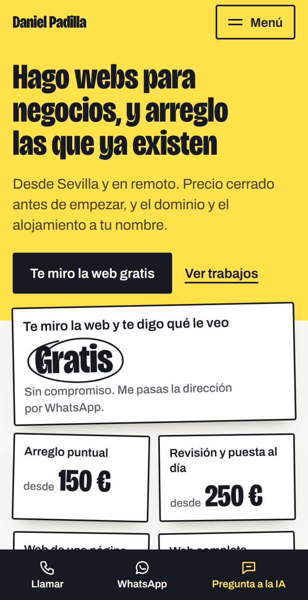
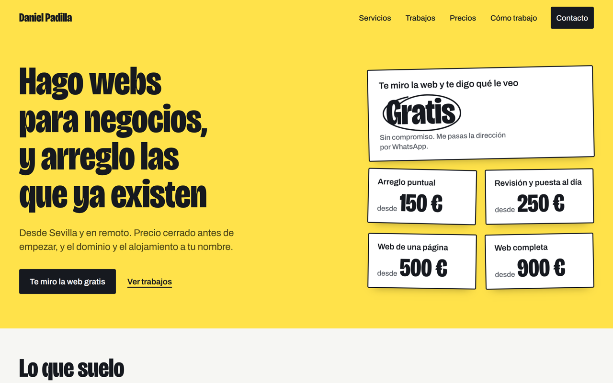
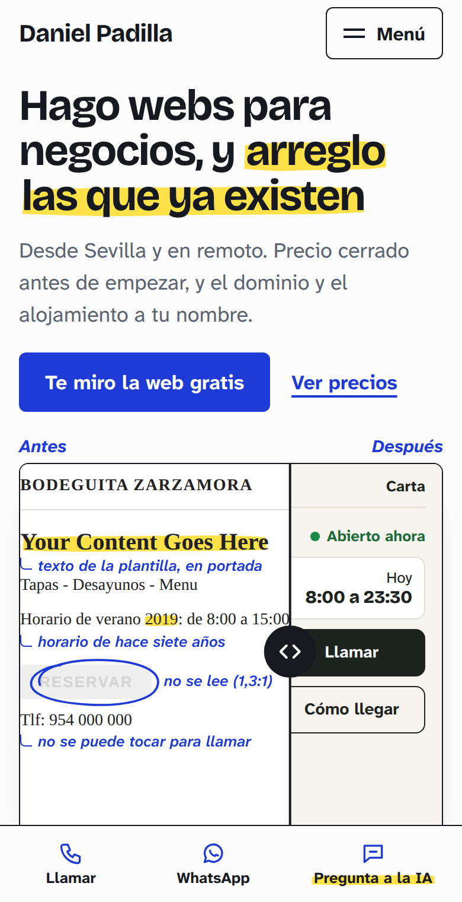
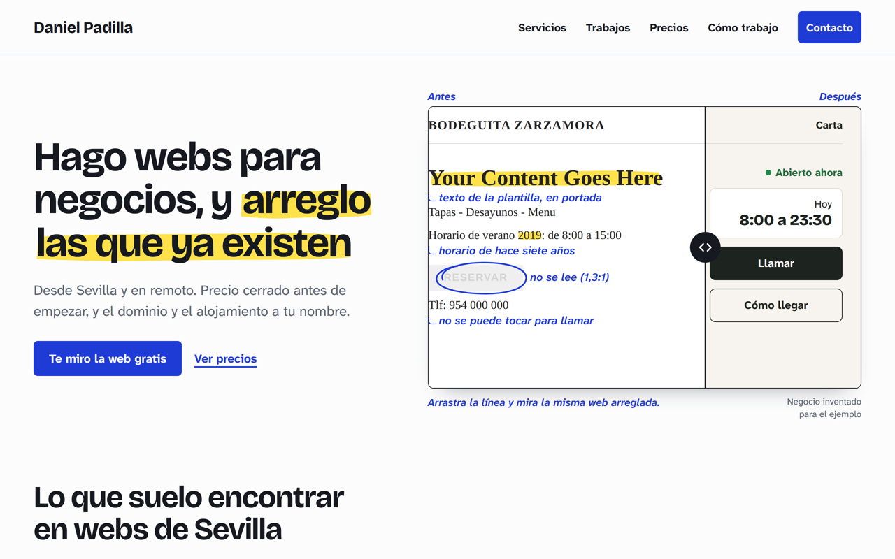

# Dirección visual y arquitectura (Fase 1)

> **Estado: esperando a que Dani elija.** No se construye ninguna página hasta tener respuesta.

## En 30 segundos

Dos direcciones, las dos evolución de "el marcador", con la misma frase de portada para que compares diseño y no texto:

| | **A · Cartel de mercado** | **B · Hoja de revisión** |
|---|---|---|
| La idea | Los precios a la vista, como los carteles de cartulina fluorescente escritos a rotulador de cualquier mercado de barrio. El amarillo del marcador deja de subrayar y pasa a ser el cartel. | La web como la hoja de trabajo de quien revisa: capturas de webs con el marcador encima, notas a boli azul y medidas exactas. Enseña el método antes de pedir nada. |
| Primera pantalla | Qué haces + cuánto cuesta. Tarjeta "Te miro la web: **Gratis**" rodeada a rotulador y los precios de partida. | Qué haces + la prueba. Una web de bar inventada, rota y anotada, que el visitante arrastra para verla arreglada. |
| Sensación | Directa, popular, imposible de confundir con otra web. | Precisa, tranquila, de profesional que sabe lo que mira. |
| Capturas | `docs/capturas/a-cartel-390.png` · `a-cartel-1280.png` | `docs/capturas/b-hoja-390.png` · `b-hoja-1280.png` |

Las dos lado a lado en móvil: `docs/capturas/comparativa-movil-390.png`.

**Mi recomendación:** B como base, con el tablón de precios de A traducido a su lenguaje (en la segunda pantalla de la portada y en `/precios/`). Motivos al final, en "Mi recomendación". Pero A es la más memorable de las dos, y si lo que quieres es que nadie te confunda con otro, es A.

**Lo que necesito que me contestes** (detalle al final):
1. A, B o una mezcla (y qué mezclarías).
2. Si me das permiso para proponerte el texto nuevo de la política de privacidad (hoy no menciona el chat ni las fotos de Unsplash).
3. Cómo resolvemos las fotos de las demos (este entorno no puede descargar de Unsplash).
4. Dos datos que faltan de los hallazgos: cuánto se tardó en arreglar el del taller y el de la tienda online.

---

## Lectura del encargo

- **Lo que es:** web de servicios de un desarrollador freelance para dueños de negocios de barrio (30-65 años, móvil, poco tiempo, desconfianza). La web es a la vez escaparate y prueba.
- **Lenguaje:** "papel de trabajo + marcador" con precisión técnica. Taller de un profesional, no agencia.
- **Diales** (de la skill design-taste-frontend): variedad de composición 6/10, movimiento 5/10, densidad 4/10. Más atrevido que una web de servicios estándar, pero sin experimentos que cuesten claridad o rendimiento en móvil.
- **Claro, no oscuro:** el visitante mira el móvil de día, en la calle o en el mostrador. Las dos direcciones son claras. **No propongo modo oscuro**: la metáfora es papel y cartulina, el público no lo echa de menos y duplicaría el trabajo de pruebas en 20 páginas. Si algún día hace falta, los colores ya van en variables.

## Cómo he llegado a estas dos

Siguiendo el método de la skill impeccable, primero listé siete mundos visuales que tu público conoce de memoria y que pueden contar "reviso, señalo y arreglo", ordenados de más a menos afinidad:

1. **Hoja de revisión**: papel, marcador y boli azul, notas al margen. → **Dirección B**
2. Captura de móvil anotada a dedo (cómo se mandan los fallos por WhatsApp).
3. La ITV de la web: informe de inspección con defectos leves y graves.
4. **Cartel de mercado**: cartulina fluorescente y rotulador. → **Dirección A**
5. Talonario de presupuestos con copias de colores.
6. Plano técnico con cotas y cajetín.
7. Control de cambios de Word: tachado, añadido y globos al margen.

La herramienta de impeccable sortea cuál de la lista se construye, para no caer siempre en la opción más previsible. Salió la **4 (Cartel de mercado)**. La otra es mi primera opción (**1, Hoja de revisión**). Del resto he tomado ideas que caben dentro: la captura anotada (2) es el antes/después de B, y la precisión del plano (6) son las cotas en px de B.

> Nota: el servicio que reparte "retadores" externos de impeccable no es accesible desde este entorno, así que el sorteo fue en modo reducido (sin retadores). La asignación sí se aplicó.

---

## Dirección A · Cartel de mercado

**La idea.** En un mercado de abastos el precio no se esconde: está escrito a rotulador en una cartulina amarilla. Esta dirección hace lo mismo: lo primero que ves es qué haces y cuánto cuesta. Responde de frente a la desconfianza hacia "los de las webs" (miedo a costes escondidos). El marcador amarillo deja de ser un subrayado y se convierte en la superficie; el gesto de marca pasa a ser el **círculo a rotulador negro**.





**Paleta** (estrategia "comprometida": el amarillo ocupa entre un tercio y la mitad de las pantallas clave):

| Rol | Color | Uso | Contraste medido |
|---|---|---|---|
| Cartulina | `#FFE24A` | Portada, carteles de precio, franja final de contacto | - |
| Rotulador | `#16191F` | Texto, bordes de tarjeta, botón principal | 13,60:1 sobre cartulina · 16,26:1 sobre papel |
| Texto secundario sobre amarillo | `#4A4214` | Bajadas y notas encima de la cartulina | 7,80:1 |
| Papel | `#F6F6F3` | Fondo del resto de secciones | - |
| Gris | `#565B63` | Texto secundario sobre papel | 6,31:1 |
| Azul | `#1F3BD6` | Solo enlaces dentro del texto y foco | 7,31:1 papel · 6,11:1 cartulina |
| Botón | blanco sobre rotulador | | 17,60:1 |

**Tipografía:**
- Titulares y precios: **Bricolage Grotesque** en su versión estrecha (eje de anchura al 75 %, peso 800). Es tu tipografía actual llevada al "rotulador" de los carteles. Números tabulares en los precios.
- Texto: **Archivo** (la actual), legible y robusta.
- Peso: 62 KB + 29 KB en `woff2` recortado a los caracteres del español, servido desde tu dominio (hoy Google Fonts bloquea el primer pintado).

**Titular de ejemplo:** "Hago webs para negocios, y arreglo las que ya existen" en estrecha 800: unos 45 px en móvil (3 líneas) y 84 px en escritorio (4 líneas).

**Gesto de movimiento principal: "el cartel se coloca".** Al cargar la portada, las tarjetas de precio caen 14 px girando hasta su sitio (0,52 s, escalonadas 70 ms) y el rotulador rodea "Gratis" (0,62 s). Una sola vez. En el resto de la web el círculo aparece solo como respuesta (al marcar una opción de la calculadora, al abrir un hallazgo). Con movimiento reducido: todo quieto y el círculo ya dibujado.

**Cómo serían las piezas clave:**
```
Precio (portada y /precios/)     Presupuesto (/precios/)                Hueco "en obras" (/trabajos/)
┌────────────────────────┐       ┌──────────────────────────────────┐   ┌ ─ ─ ─ ─ ─ ─ ─ ─ ─ ─ ┐
│ Web de una página      │ giro  │ TU PRESUPUESTO  (cartel grande)  │     Peluquería
│ desde  500 €           │ -1°   │ Web de una página ....... 500 €  │   │ cartulina con cinta │
└────────────────────────┘       │ Reservas ................ 200 €  │     de carrocero
                                 │ Asistente en tu web ..... 350 €  │   │ PRÓXIMAMENTE        │
                                 │ ──────────────────────────────── │   └ ─ ─ ─ ─ ─ ─ ─ ─ ─ ─ ┘
                                 │ TOTAL desde       ((1.050 €))    │
                                 │ + 45 €/mes del asistente         │
                                 │ [Enviárselo a Daniel por WhatsApp]│
                                 └──────────────────────────────────┘
```

**Riesgo honesto:** el amarillo en grande cansa si se abusa, y el lenguaje de cartel puede leerse como "oferta de supermercado" para una clínica o una academia. Lo contengo así: amarillo solo en portada, precios y franja final; el resto de páginas, papel claro con texto normal. Además enseña el precio antes que la prueba: el antes/después baja a la segunda pantalla.

---

## Dirección B · Hoja de revisión

**La idea.** Así trabaja Dani: abre una web, la mira con lupa, marca lo que falla y anota por qué. La portada es literalmente eso: una web de bar (inventada) con el texto de la plantilla, el horario de 2019 y un botón que no se lee, todo marcado y anotado a boli. Arrastras la línea y la ves arreglada. En cinco segundos entiendes qué hace y que sabe hacerlo.





**Paleta** (estrategia "contenida": neutros + un acento de acción; el amarillo solo como trazo):

| Rol | Color | Uso | Contraste medido |
|---|---|---|---|
| Hoja | `#FCFCFD` | Fondo | - |
| Mesa | `#E4E8ED` | Bandas y zonas "debajo de la hoja" | - |
| Tinta | `#16191F` | Texto | 17,17:1 hoja · 14,30:1 mesa |
| Gris | `#5B6470` (`#535C68` sobre mesa) | Texto secundario | 5,85:1 · 5,51:1 |
| Boli azul | `#1F3BD6` | Anotaciones, enlaces, botones | 7,71:1 hoja · 6,43:1 mesa · 6,11:1 sobre marcador |
| Botón | blanco sobre boli | | 7,91:1 |
| Marcador | `#FFE24A` | Solo trazo detrás de palabras clave (tinta encima) | 13,60:1 |

**Tipografía:**
- Titulares: **Bricolage Grotesque** en su anchura normal, peso 700, con tamaño óptico (la actual, más afinada).
- Texto y notas: **Atkinson Hyperlegible Next**, diseñada por el Braille Institute para que se distingan bien letras y cifras parecidas (I/l/1, O/0). Encaja con un público de 30 a 65 años que lee precios y teléfonos en el móvil. Su cursiva es la letra "a boli" de las anotaciones.
- Peso: 62 KB + 31 KB (+ 34 KB la cursiva; si hay que recortar, las notas van en redonda azul).

**Titular de ejemplo:** "Hago webs para negocios, y arreglo las que ya existen", con el trazo de marcador detrás de "arreglo las que ya existen". Unos 37 px en móvil (3 líneas) y 59 px en escritorio (3 líneas).

**Gesto de movimiento principal: "el marcador pasa y el boli anota".** Al cargar: el trazo amarillo barre las palabras marcadas (0,5 s), aparecen las notas a boli una a una (0,28 s, cada 140 ms) y el boli rodea el botón que no se lee. Una sola vez, y la línea del antes/después se mueve un poco para invitar a arrastrar. En el resto de la web, el marcador solo se mueve cuando tú haces algo (abrir un hallazgo, marcar una opción). Con movimiento reducido: estado final quieto y una indicación escrita "Arrastra la línea".

**Cómo serían las piezas clave:**
```
Presupuesto (/precios/)                     Hallazgo como expediente (portada, /servicios/arreglos/)
┌ hoja ────────────────────────────────┐    ┌────────────────────────────────────────────┐
│ PRESUPUESTO          Nº [auto]  fecha │    │ Una escuela de idiomas                     │
│ Web de una página ............ 500 €  │    │ "Your Content Goes Here" en portada    [+] │
│ Reservas de cita ............. 200 €  │    ├──── al abrir ──────────────────────────────┤
│ Asistente en tu web .......... 350 €  │    │ [recreación del fallo]  ◯ ← boli: "llevaba │
│ ───────────────────────────────────── │    │                            meses así"     │
│ Desde                 ▓▓1.050 €▓▓     │    │ Qué le costaba · Cuánto se tardó: 10 min   │
│ + 45 €/mes del asistente              │    └────────────────────────────────────────────┘
│ ✎ el precio final te lo paso cerrado  │
│ [Enviárselo a Daniel por WhatsApp]    │
└───────────────────────────────────────┘
```

**Riesgo honesto:** es la más cercana a la web actual en colores (papel, azul y amarillo), así que el salto se nota menos que con A; su fuerza está en las anotaciones y el antes/después, y si se hacen a medias queda "una web blanca más". Además el antes/después es una pieza fina: en una pantalla de 390 px una web dentro de otra web puede confundir unos segundos a quien no está acostumbrado; por eso lleva rótulos "Antes/Después" fuera del marco y una frase de instrucción.

---

## Comparación rápida

| | A · Cartel de mercado | B · Hoja de revisión |
|---|---|---|
| Lo que entiende el visitante en 5 s | "Hace webs y arreglos, y estos son los precios" | "Hace webs y arreglos, y mira cómo encuentra los fallos" |
| Cuánto se diferencia de cualquier otra web | Muchísimo | Bastante |
| Cómo aguanta 20 páginas (legales, clínicas, academias) | Bien si el amarillo se contiene | Muy bien |
| Encaje con tu brief ("papel de trabajo + precisión técnica") | Parcial: más papel que precisión | Total |
| Peso de fuentes | 90 KB | 93 KB (127 KB con cursiva) |
| Riesgo | Parecer "barato" a negocios más formales | Quedarse corta de impacto si se ejecuta tímida |

**Qué se puede mezclar y qué no.** Se puede: llevar el tablón de precios de A a B (tarjetas de precio en hoja blanca, rodeadas a boli) o llevar el antes/después anotado de B a la segunda pantalla de A (ya está previsto en A). No funciona: mezclar las dos paletas (A necesita el amarillo como superficie; B lo necesita como trazo escaso) ni las dos tipografías de titular.

---

## Lo que no depende de la elección

- **Cabecera:** logo + Servicios · Trabajos · Precios · Cómo trabajo + botón Contacto. En una sola línea y por debajo de 80 px de alto en escritorio.
- **Menú móvil a pantalla completa:** foco atrapado, Escape para cerrar, enlaces de 48 px, la página actual marcada (A: círculo a rotulador; B: trazo de marcador).
- **Barra inferior fija en móvil:** Llamar · WhatsApp · Pregunta a la IA (`data-ia-open`), con `safe-area`. Sustituye al botón flotante del chat en móvil (era el fallo P1 de la auditoría) y el contenido reserva su altura para que nunca tape nada.
- **Pie completo:** todas las páginas, contacto, horario y legales.
- **Chat:** se rediseña con la paleta y las tipografías elegidas (hoy usa la fuente del sistema y un azul que no es el tuyo). Se conserva exactamente su funcionamiento (contrato con `/api/chat`, aviso de IA, paso a Daniel, enlaces seguros, teclado móvil, Escape, `[data-ia-open]`), y se corrigen los dos fallos de la auditoría (foco tras enviar y botones de 38 px).
- **Reglas de movimiento** (`CLAUDE.md` §3): `transform`, `opacity` y `clip-path`; curva `cubic-bezier(.23,1,.32,1)`; nada aparece al hacer scroll salvo los momentos elegidos; nada secuestra el scroll; todo se ve completo sin JavaScript y con movimiento reducido.
  - Una excepción que quiero que conozcas: el barrido del marcador sobre texto de varias líneas se hace animando el tamaño del fondo (`background-size`), como en la web actual. Solo repinta (no recalcula el diseño), dura medio segundo y ocurre una vez. Hacerlo con `clip-path` obligaría a duplicar el titular. Si prefieres la regla estricta, se cambia por un fundido.

---

## Arquitectura técnica

### El problema

Unas 20 páginas comparten cabecera, menú, pie, barra móvil y chat. Copiarlos a mano en cada archivo garantiza que acaben distintos. Las alternativas "sin herramientas" son peores: cargarlos con JavaScript rompe la web sin JS y empeora el SEO; inyectarlos desde el Worker obliga a tocar `worker.js`.

### La propuesta: un generador de 200 líneas, sin dependencias

`scripts/construir.mjs` (Node puro, sin instalar nada) lee las páginas de `src/`, les pone la plantilla común y escribe el HTML final en `public/`. El resultado se sube al repositorio ya generado, así que **tu forma de desplegar no cambia**: descomprimes `entrega/web-deploy.zip` y `npx wrangler deploy`.

```
src/                          ← lo que se edita (no se publica)
  datos/
    negocio.json              ← precios, servicios, contacto, horario: fuente única
    sitio.json                ← URL base del dominio (cambiar de dominio = 1 línea)
  plantilla/
    base.html                 ← <head> común: metadatos, fuentes, CSS, JSON-LD
    cabecera.html  menu.html  pie.html  barra-movil.html
  paginas/
    index.html
    servicios/index.html  servicios/webs.html  servicios/arreglos.html ...
    precios.html  como-trabajo.html  sobre-mi.html  contacto.html  revision-gratis.html
    trabajos/index.html  trabajos/bar-almanaque.html ...
    aviso-legal.html  privacidad.html  404.html
scripts/
  construir.mjs               ← src → public
  dev-server.mjs              ← el de siempre (simula /api/chat)
  comprobar.mjs               ← enlaces, medidas de Playwright, capturas, precios sincronizados
public/                       ← lo que se publica
  index.html  servicios/index.html  ...   (generados: llevan un aviso "no editar aquí")
  assets/css/sitio.css        ← común a todas las páginas (se cachea una vez)
  assets/css/<momento>.css    ← solo en la página que lo usa (calculadora, antes/después...)
  assets/js/sitio.js          ← menú, barra, copiar teléfono, cargador del chat (previsto ~4 KB)
  assets/js/chat.js           ← se descarga al primer toque en "Pregunta a la IA"
  assets/js/calculadora.js  antes-despues.js  filtros.js  simulaciones.js
  assets/fuentes/*.woff2      ← autoalojadas, recortadas al español
  assets/img/trabajos/*.avif + *.webp
  demos/                      ← intactas
  robots.txt  sitemap.xml  llms.txt  og/*.png
```

Cómo es una página en `src/`: HTML normal con una cabecera de datos y marcas para los precios.

```html
<!--{ "titulo": "Arreglo y revisión de webs en Sevilla", "descripcion": "...",
      "ruta": "/servicios/arreglos/", "migas": ["Servicios", "Arreglos"] }-->
<main>
  <h1>Arreglo tu web sin rehacerla</h1>
  <p>Un arreglo puntual cuesta desde {{precio:arreglo}}.</p>
</main>
```

**Una sola fuente de verdad para los precios** (`negocio.json`). De ahí salen: los textos de cada página, la calculadora, el JSON-LD (`Offer` y cuotas con `unitCode: "MON"`), `llms.txt` y la tabla de precios. `comprobar.mjs` falla si un precio de `negocio.json` no coincide con `docs/NEGOCIO.md` o con el texto `SYSTEM` del asistente en `worker.js` (que se actualiza a mano en la Fase 5: prefiero no tener un script reescribiendo `worker.js`).

**Una sola fuente para el dominio** (`sitio.json`): canonical, Open Graph, sitemap, robots, JSON-LD y la lista de dominios permitidos del chat salen de ahí. `docs/CAMBIO-DE-DOMINIO.md` dirá qué más tocar (`ALLOWED_ORIGINS` de `wrangler.jsonc` y el texto legal).

### Presupuesto de peso por página

| | Límite | Previsto |
|---|---|---|
| JavaScript (sin chat) | 90 KB comprimido | previsto: 5-20 KB según la página |
| Chat | aparte, bajo demanda | ~3-4 KB (hoy: 3,1 KB con Brotli, HTML + CSS + JS) |
| CSS | - | ~10 KB comprimido común + 2-4 KB por momento estrella |
| Fuentes | 2 archivos, precarga solo de la de titulares | ~90 KB |
| Imágenes | AVIF/WebP con `width`/`height`, `lazy` fuera de la primera pantalla | según página |

### GSAP: no lo propongo (por ahora)

Medido (GSAP 3.15): núcleo + Flip + ScrollTrigger son **51 KB con Brotli** (25,7 + 8,7 + 16,2) o 56 KB con gzip. Cabe en el presupuesto, pero ninguno de los momentos elegidos lo necesita:
- Reordenar los trabajos al filtrar → **View Transitions** del propio navegador (lo que hace Flip, gratis). Sin soporte, el filtro funciona sin animación.
- La línea del proceso ligada al scroll → **animaciones CSS ligadas al scroll** con `@supports`. Sin soporte, la línea aparece dibujada.
- Contador del total, antes/después, simulaciones → CSS y unas pocas líneas de JS.

Si en la Fase 4 algún momento no llega con CSS, se añade solo el plugin necesario, autoalojado en `public/assets/vendor/`.

---

## Momentos estrella: cuáles sí y cuáles no

| # | Momento | Decisión | Dónde | Cómo | Sin JS | Movimiento reducido |
|---|---|---|---|---|---|---|
| 1 | Antes/después arrastrable | **Sí** | Portada (1.ª pantalla en B, 2.ª en A) | HTML/CSS, `clip-path` + `transform`; se arrastra **solo desde la línea** (zona de 44 px), el resto del marco deja pasar el scroll; teclado con flechas | Se ven las dos versiones, una debajo de otra | Sin la pista animada |
| 2 | Hallazgos como expedientes | **Sí** | Portada y `/servicios/arreglos/` | `<details>` (funciona sin JS) con la recreación del fallo y el marcador rodeándolo al abrir | Se abren igual | El círculo aparece ya dibujado |
| 3 | El presupuesto que se escribe solo | **Sí** | `/precios/` (y acceso desde portada) | Cada opción se escribe como línea; total con contador tabular de 300 ms; botón "Enviárselo a Daniel por WhatsApp" con el desglose; barra fija con el total en móvil | Tabla de precios completa + botón de WhatsApp | Cambios instantáneos |
| 4 | Visor de pantallas | **Sí, cambiado** | `/trabajos/` y cada caso | **Capturas** a 390 y 1280 px (AVIF/WebP) con transición móvil ↔ escritorio; botón "Abrir la demo". **Sin iframes**, tampoco en escritorio: así se arregla el fallo del ancho falso, no hay dedo atrapado y no se cargan las fuentes y fotos de terceros de las demos | Se ven las dos capturas | Cambio sin transición |
| 5 | Simulaciones de automatizaciones | **Sí** | `/servicios/automatizaciones-ia/` | Bandeja de correo que se clasifica y transcripción de llamada que empieza "Soy un asistente de inteligencia artificial…". **Se reproducen al pulsar "Ver simulación"**, no al hacer scroll. Rotuladas "Simulación". Y "Pruébalo tú: este chat es uno de ellos" (`data-ia-open`) | Se ve el estado final | Estado final directo |
| 6 | Transiciones entre páginas | **Sí** | Toda la web | `@view-transition { navigation: auto; }` y la captura de la tarjeta se convierte en la cabecera del caso. Solo CSS | Navegación normal | Desactivadas |
| 7 | El proceso como un trazo | **Sí, contenido** | `/como-trabajo/` | Línea de marcador que se dibuja con el scroll (CSS, con `@supports`); en móvil, vertical y sin fijar nada | Línea ya dibujada | Línea ya dibujada |
| 8 | Filtros de trabajos con reordenación | **Sí** | `/trabajos/` | Botones de filtro + View Transitions (sin GSAP Flip) | Se ven todos los grupos, sin filtros | Sin animación |
| 9 | 404 con gracia | **Sí** | `404` | El marcador tacha la dirección rota: "Es justo el tipo de fallo que reviso" | Texto sin la dirección | Tachado ya hecho |
| 10 | Microinteracciones | **Sí** | Toda la web | Botones que responden al toque (escala 0,97), copiar teléfono con aviso, enlaces con subrayado de marcador, cifras tabulares | - | Sin escala |
| - | `pin` de ScrollTrigger, iframes vivos, tablet en el visor | **No** | | No cuentan nada que lo de arriba no cuente, y cuestan peso o rompen el móvil | | |

---

## Cosas que debes saber (y en alguna no estoy de acuerdo con el brief)

1. **Visor sin iframes, también en escritorio.** El brief permite iframe en escritorio. Lo desaconsejo: es justo donde está el fallo del ancho falso, carga una web entera (con sus fuentes de Google y sus fotos de Unsplash) dentro de otra, y una captura bien hecha enseña lo mismo. El botón "Abrir la demo" lleva a la de verdad.
2. **La política de privacidad necesita cambiar**, y no la toco sin tu permiso. Hoy dice que la web no recoge datos y que la única conexión externa es Google Fonts, pero el chat envía lo que escribe el visitante a Anthropic (vía tu Worker) y la portada carga fotos de Unsplash. Con el rediseño, fuentes y fotos van autoalojadas, así que solo quedará el chat. En la Fase 5 te propongo el párrafo exacto.
3. **Fotos de las demos.** Las demos cargan sus fotos de `images.unsplash.com`, y la configuración de red de este entorno lo bloquea: las capturas de las demos saldrían con huecos vacíos. Opciones: (a) añadir `images.unsplash.com` a los dominios permitidos del entorno (menú del entorno en la barra de título de la sesión → Editar → acceso a red); (b) pasarme tú las fotos; (c) que las autoalojemos (lo que ya recomendaba `ESTADO-ACTUAL`), para lo que también necesito (a) o (b). Mi preferida: (a) + (c).
4. **Hallazgos sin dato de tiempo.** De la carpintería ("media mañana") y la escuela ("diez minutos") lo sé. Del taller mecánico y de la tienda online no consta cuánto se tardó. No lo invento: irá como `[PENDIENTE: ...]` hasta que me lo digas.
5. **"Pregunta a la IA" mientras no hay crédito.** La barra móvil pone el chat a un toque en todas las páginas. Mientras la cuenta de Anthropic esté sin crédito, la primera experiencia de mucha gente será "ahora mismo no puedo responder, habla con Daniel". No está roto, pero es un mal primer contacto. Recomiendo recargar crédito antes de publicar el rediseño.
6. **Páginas de caso de negocios ficticios.** Las dejo indexables (son contenido útil sobre cómo trabajas), rotuladas como ficticias en la cabecera de cada una, como ya haces.
7. **Sin modo oscuro** (explicado arriba).
8. **He creado `PRODUCT.md`** en la raíz: es el resumen del negocio que necesita la skill impeccable, compilado de tus documentos (sin precios: remite a `NEGOCIO.md`). Échale un ojo cuando puedas; si algo no te representa, se corrige.

---

## Mi recomendación

**B como base, con el tablón de precios de A traducido a B** (tarjetas de precio en hoja blanca, rodeadas a boli, en la segunda pantalla de la portada y en `/precios/`).

Por qué:
- Es lo que describe tu propio brief ("papel de trabajo" + "precisión técnica", "taller de un profesional").
- Demuestra en la primera pantalla. El precio se cuenta enseguida, pero la prueba de que sabes es lo que te diferencia de "un sobrino que hace webs".
- Aguanta mejor 20 páginas tranquilas (legales, clínica, academia, sobre mí).

Por qué podrías preferir A: es más valiente, se recuerda más y contesta de frente a la pregunta que todos hacen primero ("¿cuánto me va a costar?"). Si eliges A, el antes/después va justo debajo, en la segunda pantalla.

---

## Lo que necesito que me contestes

1. **Dirección:** A, B, o mezcla (dime qué te gusta de cada una).
2. **Privacidad:** ¿te propongo el texto nuevo en la Fase 5? (sí/no)
3. **Fotos de las demos:** (a) abres `images.unsplash.com` en el entorno, (b) me pasas fotos, o (c) seguimos sin fotos en las capturas por ahora.
4. **Hallazgos:** cuánto se tardó en arreglar el del taller mecánico y el de la tienda online (o lo dejo como pendiente).

Opcional: si algo de las capturas no te convence (un color, el tamaño del titular, una palabra), dímelo ahora: es más barato cambiarlo antes de construir.

## Después de tu respuesta

Fase 2 (sistema base: tokens, fuentes, cabecera, menú, barra, pie, chat compartido, generador y `scripts/comprobar.mjs`) → Fase 3 (todas las páginas, móvil primero) → Fase 4 (momentos estrella) → Fase 5 (SEO, GEO, asistente) → Fase 6 (control de calidad con revisor independiente, informe final, zip de despliegue y pull request).

---

### Anexo: las maquetas

- HTML: `docs/maquetas/a-cartel.html` y `docs/maquetas/b-hoja.html`, con las fuentes recortadas en `docs/maquetas/fuentes/`. Son solo la primera pantalla de la portada (más el arranque de la sección siguiente). El antes/después de B funciona de verdad (ratón, dedo y teclado).
- Para abrirlas en tu ordenador hace falta un servidor local (las fuentes no cargan con doble clic): `npx http-server docs/maquetas` y abre la dirección que te indique.
- Comprobado en las dos, a 360, 390 y 1280 px: sin scroll horizontal, sin texto por debajo de 12 px, sin zonas táctiles por debajo de 44 px, márgenes laterales de 16 px en móvil, fuentes cargadas y sin errores de consola; con movimiento reducido el contenido se ve completo. Arrastre con eventos táctiles reales: el gesto horizontal mueve la línea y el vertical desplaza la página. Limitación conocida de la maqueta: al apoyar el dedo en cualquier punto del marco, la línea salta a ese punto; en la versión final solo se arrastrará desde la propia línea.
