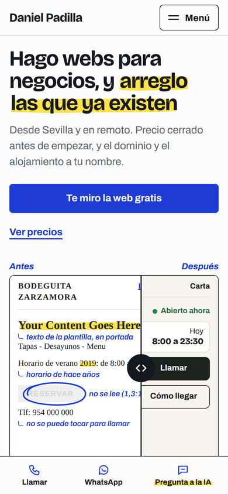
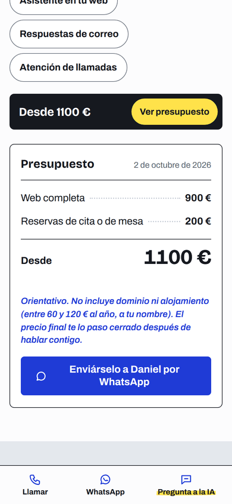
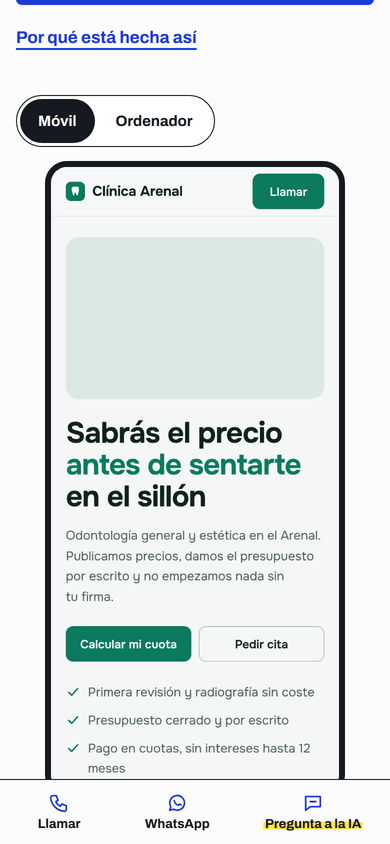
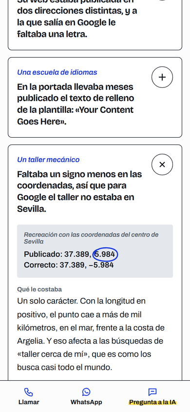
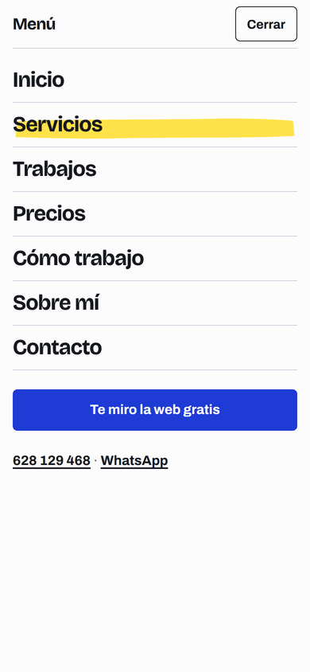
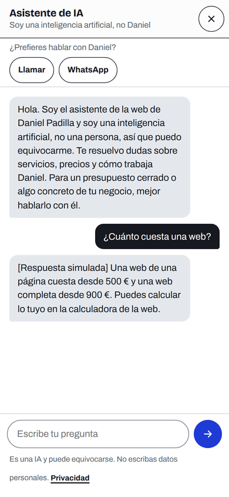

# Informe final del rediseño

Dani: esto es lo que se ha hecho, cómo está comprobado, lo que falta y cómo publicarlo. Si solo lees una parte, lee **«Cómo publicarlo»** y **«Lo que queda pendiente»**.

## En corto

- La web pasa de una sola página a **20 páginas** (17 que Google puede indexar, más el 404 y las dos legales), con la dirección **B, «Hoja de revisión»**, y el **tablón de precios de la A** en la portada y en `/precios/`. Como me dijiste que la construyera sin esperar a elegir, fui con mi recomendación; si prefieres la A, se puede cambiar sobre esta base.
- Todo lo que dice la web sobre precios, plazos y contacto sale de un solo archivo (`src/datos/negocio.json`, copia de `docs/NEGOCIO.md`), y el dominio de otro (`src/datos/sitio.json`). Así no hay precios distintos en sitios distintos y el cambio a `webpadilla.com` es una línea.
- **Lighthouse móvil**: rendimiento 98-100, accesibilidad, buenas prácticas y SEO a 100 en las seis páginas medidas. Antes: 85 de rendimiento y LCP de 3,1 s en la portada.
- El chat funciona igual que antes, pero ahora está en todas las páginas. El de verdad (con la API) **no se puede probar aquí**: lo he probado contra el servidor local, que contesta con respuestas simuladas.
- No he desplegado nada. Los pasos para que lo hagas tú, con vista previa antes, están abajo.

## Qué se ha hecho, por fases

Cada fase es un commit en la rama `claude/happy-pascal-x1kksy`:

| Fase | Qué | Dónde mirarlo |
|---|---|---|
| 0 | Auditoría de la web publicada: lo que funcionaba (y se conserva) y lo que fallaba | `docs/AUDITORIA.md` |
| 1 | Dos direcciones visuales con maquetas y capturas, mapa de la web y momentos estrella | `docs/DIRECCION.md`, `docs/maquetas/`, `docs/capturas/` |
| 2 | Sistema base: colores, fuentes autoalojadas, cabecera, menú, pie, barra móvil, chat compartido, generador y comprobaciones | `public/assets/`, `src/plantilla/`, `scripts/` |
| 3 | Las 20 páginas | `src/paginas/` → `public/` |
| 4 | Momentos estrella probados en un móvil táctil | `scripts/probar-momentos.mjs` |
| 5 | SEO, datos estructurados, imágenes para compartir, `llms.txt`, texto del asistente, cambio de dominio | `public/og/`, `worker.js` (solo `SYSTEM`), `docs/CAMBIO-DE-DOMINIO.md` |
| 6 | Control de calidad, revisión independiente, este informe y el zip | este archivo, `entrega/web-deploy.zip` |

### Las páginas

| Página | Lo principal |
|---|---|
| `/` | Antes/después arrastrable (tu web rota y arreglada), los hallazgos reales, el tablón de precios, tres trabajos y cómo trabajas |
| `/servicios/` + una página por servicio | Webs, arreglos, automatizaciones con IA (con dos simulaciones) y herramientas a medida |
| `/trabajos/` | Los trabajos agrupados por lo que resuelven, con filtros, y los huecos «En obras» de las demos que faltan |
| `/trabajos/<caso>/` | Una página por demo: el problema, qué hace, por qué está hecha así, y un visor con la captura en móvil y en ordenador |
| `/precios/` | Calculadora que escribe el presupuesto línea a línea y te lo manda por WhatsApp con el desglose; todas las tablas de precios |
| `/como-trabajo/`, `/sobre-mi/`, `/contacto/`, `/revision-gratis/` | Proceso, condiciones y preguntas frecuentes; quién eres; contacto con mensajes ya escritos; la revisión gratis |
| `/aviso-legal`, `/privacidad`, 404 | Rediseñadas; los datos legales no se han tocado |

Las direcciones viejas con ancla (`/#servicios`, `/#trabajos`, `/#preguntas`...) llevan a su página nueva, así que los enlaces que tengas compartidos siguen funcionando.

## Capturas clave

Están en `docs/capturas/final/` (móvil a 390 px salvo las de 1280). Las fotos de las demos salen como bloques de color: ver pendientes.

| Portada (móvil) | Precios: la hoja se escribe sola | Un caso, con el visor |
|---|---|---|
|  |  |  |
| **Un hallazgo abierto** | **Menú** | **Asistente (respuesta simulada)** |
|  |  |  |

En escritorio: [portada](capturas/final/inicio-1280.png) · [precios](capturas/final/precios-1280.png). La portada entera en móvil: [inicio-390-completa.png](capturas/final/inicio-390-completa.png). Trabajos: [trabajos-390.png](capturas/final/trabajos-390.png).

## Cómo está comprobado

Todo esto se ha medido, no supuesto:

- **`node scripts/comprobar.mjs`**: rastrea todas las páginas (ningún enlace roto; la ruta inexistente da el 404 propio), compara los precios de `negocio.json` con `NEGOCIO.md` y con el texto del asistente, y abre cada página con Playwright a **360, 390, 768 y 1280 px**, más **movimiento reducido** (360 y 1280) y **sin JavaScript** (390). En cada una: sin scroll horizontal, ninguna zona táctil por debajo de 44 × 44 px, ningún texto por debajo de 12 px, márgenes laterales de 16 px o más en móvil, un solo `h1`, títulos sin saltos, imágenes con `alt`, `width` y `height`, sin errores de consola ni peticiones fallidas. **Resultado: sin errores.**
- **`node scripts/probar-momentos.mjs`**: 64 pruebas de interacción en un móvil táctil simulado (y el chat también en escritorio). Entre otras: arrastrar el antes/después con el dedo, y que deslizar en vertical encima haga scroll de la página (no atrapa el dedo); la calculadora suma bien, enseña la cuota y manda el desglose por WhatsApp; filtros, visor, simulaciones, menú (foco y Escape) y chat (aviso de IA, respuesta, bloque de «pasar con Daniel», enlaces seguros, Escape y foco). **Resultado: 64 de 64.**
- **Capturas** de cada página a 390 y 1280 px revisadas a ojo, trozo a trozo. De ahí salieron arreglos que ninguna medida detecta (huecos dobles entre secciones, enlaces repetidos, un precio en gris, la línea doble del pie).
- **Contraste** de cada pareja de color calculado (todas AA o mejor; la más justa, gris sobre el fondo gris claro, 4,87:1).
- **Detector de `impeccable`** en las 20 páginas. Lo que queda está justificado: el «antes» del comparador usa a propósito Times/Arial y un botón gris sobre gris (1,3:1) porque es la recreación de una web rota, y lleva su descripción para lectores de pantalla; los avisos de «relleno estrecho» en secciones y tarjetas con imagen a sangre son falsos positivos (el detector no resuelve el `clamp()` del espaciado), y los de `html`/`body` vienen del `overflow-x` que ya existía.
- **Peso de JavaScript**: como máximo **3,9 KB comprimidos** por página (en `/precios/`), más 3,4 KB del chat, que solo se descarga al abrirlo. El presupuesto era de 90 KB. No ha hecho falta GSAP: todo el movimiento es CSS y unas pocas líneas propias.

### Lighthouse móvil (Moto G simulado con 4G lento)

| Página | Rendimiento | Accesibilidad | Buenas prácticas | SEO | LCP | CLS |
|---|---|---|---|---|---|---|
| `/` | 99 | 100 | 100 | 100 | 2,0 s | 0 |
| `/precios/` | 98 | 100 | 100 | 100 | 2,1 s | 0 |
| `/trabajos/` | 98 | 100 | 100 | 100 | 2,4 s | 0,001 |
| `/trabajos/bar-almanaque/` | 98 | 100 | 100 | 100 | 2,3 s | 0,001 |
| `/servicios/automatizaciones-ia/` | 98 | 100 | 100 | 100 | 2,1 s | 0,017 |
| `/contacto/` | 100 | 100 | 100 | 100 | 1,7 s | 0,008 |

Medido contra el servidor local, que no comprime: en Cloudflare (que sirve con Brotli) pesará menos todavía. Al principio `/precios/` daba un CLS de 0,17 (la página «saltaba» al llegar la fuente); se arregló con una fuente de respaldo ajustada a las medidas de Archivo, y ahora es 0.

### Revisión independiente

Como pide el brief, un revisor que no había construido nada repasó las 20 páginas a 360, 390, 768 y 1280 px, sin JavaScript, con movimiento reducido, con teclado, con el menú y el chat abiertos, y comparó cada cifra con `NEGOCIO.md`. Confirmó que los precios coinciden en toda la web, en los datos estructurados, en `llms.txt` y en el asistente, y encontró esto (todo corregido salvo lo indicado):

| Gravedad | Hallazgo | Qué se ha hecho |
|---|---|---|
| Grave | La política de privacidad decía que la web no conecta con terceros, pero 4 de las 5 demos cargan Google Fonts y fotos de Unsplash | Corregido el párrafo de terceros: ahora lo dice |
| Grave | En la hoja de presupuesto, «300 € + 40 €/mes» se salía de la tarjeta a 360 y a 1280 px | El alta y la cuota van en dos líneas; la cifra no se corta en ningún ancho |
| Medio | La etiqueta «Simulación» se cortaba a 320-390 px | Corregido |
| Medio | En escritorio, al saltar a un ancla, la cabecera fija tapaba el principio | Margen de desplazamiento bajo la cabecera |
| Medio | Al tabular en móvil, el foco quedaba debajo de la barra inferior (y del total flotante en Precios) | Margen de desplazamiento sobre la barra |
| Medio | Sin JavaScript se veían botones que no hacen nada (filtros, Móvil/Ordenador, «Pregunta a la IA») | Ocultos sin JavaScript; la barra se queda en Llamar y WhatsApp |
| Medio | Arreglos, herramientas y automatizaciones no tenían «qué no incluye» (y automatizaciones, plazo), que pide el brief | Añadidos con lo que dice `NEGOCIO.md`. En herramientas no hay datos para una lista: dice que va por escrito en el presupuesto y queda `[PENDIENTE]` |
| Medio | La barra del total en Precios medía 131 px y partía el texto | Una sola línea de 60 px con botón |
| Menor | Textos: «una alta», «Pruébalo: este chat es uno», «Qué hace la web» en una herramienta, «y cómo se arregló» en hallazgos que no lo cuentan, «vivo en Sevilla» (vives en Castilleja), mantenimiento sin «desde», «reservas» en el título de Trabajos, «Es un/a» en un WhatsApp, «hace siete años» que caducaría en 2027 | Todos corregidos |
| Menor | En el chat, «WhatsApp» quedaba solo en otra línea | Llamar y WhatsApp van siempre juntos |
| Menor | El «Añadir a la cesta» de la recreación de la tienda no parecía un botón | Ahora sí |
| Menor | Las descripciones para buscadores de 14 páginas eran demasiado largas (hasta 198 caracteres); el 404 llevaba `canonical` | Todas por debajo de 160; el 404 ya no lo lleva |
| Menor | La imagen para compartir de Precios no tenía precios, la de automatizaciones no decía «IA» y la de Academia cortaba la captura | Corregidas |
| Menor | Cada caso descargaba las dos capturas aunque solo se ve una | Ahora solo se descarga la que se ve |
| Opinión | La cursiva de Archivo (31 KB) se carga casi en todas las páginas | **Se queda**: es la letra de las anotaciones a boli, que son la idea de la dirección B, y se descarga una vez (luego sale de la caché) |
| Opinión | Las notas en cursiva azul se pueden confundir con enlaces | **Se queda**: son las anotaciones «a boli»; los enlaces van siempre subrayados y las notas nunca |
| Opinión | Los hallazgos de la portada y de Arreglos son los mismos | **Se queda**: son los cuatro casos reales, lo más convincente que tienes; la introducción de cada página es distinta |

Además, de la revisión salió una comprobación nueva en `scripts/comprobar.mjs`: cualquier cifra en euros escrita a mano en una página, en su descripción o en `llms.txt` que no exista en `negocio.json` da error.

## Decisiones que conviene que conozcas

1. **Visor de los casos con capturas, no con la demo metida dentro (iframe).** En móvil, una demo dentro de otra web atrapa el dedo y carga una web entera. La captura enseña lo mismo y el botón «Abrir la demo» lleva a la de verdad.
2. **Los huecos dicen «En obras», no «En mantenimiento».** El brief decía «En mantenimiento», pero en tu web «mantenimiento» es un servicio que vendes (80 € al mes): un cliente podría pensar que esas tarjetas son eso. Si lo prefieres como decía el brief, es cambiar dos palabras en `src/paginas/trabajos/index.html`.
3. **Fuente de texto: Archivo, no Atkinson Hyperlegible.** Probé Atkinson y su cero va tachado (los precios se leían «5Ø0 €») sin forma de quitarlo. Archivo es la que ya usabas.
4. **Corregí una cifra de los hallazgos.** El del taller decía que el punto caía «a miles de kilómetros». Con las coordenadas de Sevilla y la longitud en positivo, cae a unos 1.050 km, en el mar, frente a la costa de Argelia. Ahora dice eso.
5. **Política de privacidad: solo he cambiado el párrafo de terceros**, que ya no era verdad (decía Google Fonts; ahora las fuentes son propias y lo único externo es el chat, que envía lo que se escribe a Anthropic). El resto, ver pendientes.
6. **El asistente sabe ya lo nuevo.** En `worker.js` solo ha cambiado el texto `SYSTEM`: precios de los extras, la calculadora de Precios, las páginas nuevas, la revisión gratis, tu correo y el horario completo.
7. **El botón «Pregunta a la IA» de escritorio** aparece al bajar un poco, para no tapar la portada ni la hoja de presupuesto al cargar. En móvil está siempre en la barra de abajo.
8. **La página `/sobre-mi/`** tiene un hueco preparado para tu foto (con tus iniciales mientras no la haya) y un bloque de opiniones **oculto**, listo para cuando un cliente real te dé permiso. No hay ninguna opinión ni cifra inventada en la web.

## Lo que queda pendiente

| # | Qué | Por qué no está | Qué hacer |
|---|---|---|---|
| 1 | **Crédito en la cuenta de Anthropic** | Sin crédito, el chat contesta «habla con Daniel» a todo | Recárgalo antes de publicar (console.anthropic.com → Billing) |
| 2 | **Fotos en las capturas de las demos** | Este entorno no puede descargar de `images.unsplash.com`, así que las capturas tienen bloques de color donde van las fotos | En tu ordenador: `npm i -D playwright sharp`, `npx playwright install chromium` y `node scripts/capturas-demos.mjs`; o abre ese dominio en la red del entorno y lo hago yo |
| 3 | **Tu foto** en `/sobre-mi/` | No la tengo | Pásamela (4:3, unos 800 px) o sigue las instrucciones del comentario en `src/paginas/sobre-mi.html` |
| 4 | **Cuánto se tardó** en arreglar lo del taller y lo de la tienda | No consta y no lo invento | Dímelo y lo añado (están marcados con `[PENDIENTE]` en `src/plantilla/expedientes.html`) |
| 5 | **Resto de la política de privacidad** | Es contenido legal: no lo cambio sin tu permiso | Ver la propuesta de abajo |
| 6 | **Las 6 demos que faltan** (2 webs con asistente, 4 de reservas) | Las haces tú | El comentario de `src/paginas/trabajos/index.html` explica cómo cambiar un hueco por una demo |
| 7 | **Dominio `webpadilla.com`** y correo `hola@webpadilla.com` | Aún no los tienes | `docs/CAMBIO-DE-DOMINIO.md` |
| 8 | **Probar el chat de verdad** | Aquí no hay acceso a la API | Tras publicar (o en la vista previa), hazle dos o tres preguntas, una de ellas pidiendo presupuesto, y comprueba que te ofrece llamar o WhatsApp |
| 9 | **Qué no incluye una herramienta a medida** | `NEGOCIO.md` no lo dice; la página dice que va por escrito en el presupuesto | Dímelo (alojamiento, cambios tras la entrega...) y lo pongo en lista, como en las otras páginas de servicio |

### Propuesta para la política de privacidad (no aplicada)

Hoy hay tres frases que no encajan del todo con el chat:

- El resumen dice que la web «no recoge ningún dato de quien la visita», y el apartado 2 que «no dispone de formularios» y que «no se recoge ningún dato de forma automática». El chat sí recibe lo que la persona escribe, y Cloudflare usa la dirección IP para limitar los mensajes por minuto.
- El apartado 6 no nombra a Anthropic (que procesa el texto del chat) ni a Cloudflare (alojamiento), y ambos pueden implicar transferencias fuera de la UE.

- Además, `wrangler.jsonc` tiene activados los registros de Cloudflare (`observability`): Cloudflare guarda hasta 7 días un registro técnico de cada petición al Worker.

Propuesta: añadir al apartado 2 un punto «Si usas el asistente de IA: el texto que escribes en el chat, que se envía a Anthropic para generar la respuesta, y tu dirección IP, que se usa para limitar el número de mensajes por minuto. Esta web no guarda la conversación», mencionar los registros técnicos del alojamiento, y añadir al apartado 6 «Anthropic, PBC, proveedor del modelo de inteligencia artificial del asistente, y Cloudflare, Inc., proveedor de alojamiento, en su condición de encargados del tratamiento», ajustando el resumen. **Antes de publicarlo, que lo valide quien te lleve lo legal**, y confirma en tus cuentas de Anthropic y Cloudflare qué guardan, cuánto tiempo y dónde (desde aquí no lo puedo comprobar).

## Cómo publicarlo (Windows, CMD)

Igual que la última vez, pero con un paso de **vista previa** antes de que lo vea nadie.

1. **Consigue los archivos.** En GitHub, en el repositorio `Pruebas`, elige la rama `claude/happy-pascal-x1kksy` (o `main`, si ya has fusionado el pull request), entra en la carpeta `entrega`, abre `web-deploy.zip` y pulsa el botón de descarga.
2. **Descomprímelo en una carpeta nueva**, por ejemplo `C:\web-nueva` (clic derecho → Extraer todo). Dentro tienen que quedar `worker.js`, `wrangler.jsonc` y la carpeta `public`. No lo descomprimas encima de la carpeta vieja.
3. **Abre CMD en esa carpeta:**
   ```
   cd /d C:\web-nueva
   ```
4. **Sube una versión sin publicarla:**
   ```
   npx wrangler versions upload
   ```
   Si te pide iniciar sesión: `npx wrangler login` y repite. Al terminar verás una línea **Version Preview URL** con una dirección del tipo `https://xxxxxxxx-web.<tu-subdominio>.workers.dev`. **Ábrela en el móvil**: es la web nueva, con el chat de verdad, pero tu web pública sigue siendo la de antes. Si no sale esa línea, actívalo en el panel de Cloudflare (Workers y Pages → `web` → Settings → Domains & Routes → **Version URLs** → Enable) y repite el paso 4.
5. **Revisa en el móvil**: el menú, dos o tres páginas, la calculadora de Precios, Trabajos (y un caso), el botón de llamar y el de WhatsApp, y el chat.
6. **Si todo está bien, publícala:**
   ```
   npx wrangler versions deploy
   ```
   Elige la versión que acabas de subir (la primera de la lista), pon **100 %** y confirma. Otra forma, igual de válida: `npx wrangler deploy` (sube y publica de una vez).
7. **Comprueba** en la salida que aparecen `env.CHAT_LIMITER`, `env.ASSETS` y `env.ALLOWED_ORIGINS`. Si no salen, no sigas y avísame.
8. **Si algo sale mal después de publicar**, vuelve a la versión anterior en un minuto:
   ```
   npx wrangler rollback
   ```
   y elige la versión anterior de la lista.

No hace falta volver a meter la clave de la API: está guardada en Cloudflare y se conserva entre versiones.

## Para seguir trabajando en la web

- Los textos se cambian en `src/paginas/` (o en `src/plantilla/` si son comunes) y luego `node scripts/construir.mjs`. **No edites el HTML de `public/` a mano**: se sobrescribe.
- Un precio se cambia en `docs/NEGOCIO.md` **y** en `src/datos/negocio.json`; `node scripts/comprobar.mjs --rapido` avisa si no coinciden entre sí o con el asistente.
- Antes de publicar un cambio: `node scripts/comprobar.mjs` y `node scripts/probar-momentos.mjs`.
- Todo está explicado en `docs/ESTADO-ACTUAL.md`.
